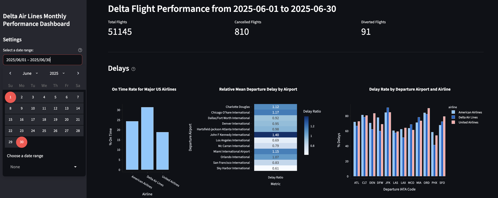

# Flight Data Pipeline and Analysis

## Project Overview

This is a Python-based ETL pipeline that extracts real-time and historical flight data from the AviationStack API (Paid Plan), stores it in a SQL database, and visualizes key travel insights in a Streamlit dashboard. The system designed can support personal travel planning  and business-level operational insights by analyzing flight delays for various airlines and airports. The project is comprised of **two parts**: an ETL pipeline for data extraction and storage, and applied analyses demonstrating its utility for both business operations and travel planning insights. Analyses and key learnings will be summarized in a slide deck linked [here](https://github.com/melissalau189/Project-Portfolio/blob/main/Aviation%20Project%20Slide%20Deck.pdf).  

**Skills**:   
* AviationStack API Data Retrieval and Processing  
* Data Wrangling & Transformation via Python  
* Data Aggregation with Python and SQL  
* Interactive Dashboard Development using Streamlit  
* Data Presentation and Communication using Google Slides

## [Part 1: ETL Pipeline](https://github.com/melissalau189/Project-Portfolio/blob/main/flights_etl.ipynb)

The project includes a Python-based ETL (Extract, Transform, Load) pipeline that collects flight data, transforms it for analysis, and loads it into a SQL database for long-term storage and exploration. This allows users to maintain large datasets and perform ongoing analyses over time.

**Pipeline Steps**  

1. Extract:
    * Retrieve flight data (real-time or historical up to 3 months) using the AviationStack API.
    * Users can specify optional filters like departure and/or arrival airport coodes or airline codes.
2. Transform:
    * Clean and prepare the data using `pandas`:
      * Handle missing values
      * Drop duplicates
      * Aggregate relevant metrics
      * Join tables
    * Data imputation step:
      * The pipeline will prompt the user to choose whether to perform data imputations for delay.
      * Imputation is an option if missing values are small (<5–10%), but if is higher, then it may affect analyses.
3. Load:  
    * Insert processed data into a SQL database using `sqlalchemy`.
    * Users can append to an existing database or overwrite tables if needed.

**Pipeline Parameters**

| Parameter           | Definition                                             |
| ------------------- | ------------------------------------------------------ |
| `access_key`        | AviationStack API Key                                  |
| `start_date`        | Start date in `YYYY-MM-DD` format                      |
| `end_date`          | End date in `YYYY-MM-DD` format                        |
| `dep_code_list`     | List of IATA code(s) of departure airport (optional)   |
| `arr_code_list`     | List IATA code(s) of arrival airport (optional)        |
| `airline_code_list` | List of airline IATA codes (optional)                  |
| `username`          | MySQL username                                         |
| `database_password` | Database password                                      |
| `hostname`          | Hostname or IP address of SQL server                   |
| `port`              | Port number for SQL connection                         |
| `database_name`     | Name of database to store the data                     |
| `create_database`   | Set `True` to create new DB or `False` to use existing |
| `if_exists`         | `"append"` to add data, `"replace"` to overwrite table |
| `version_tag`       | Optional suffix to distinguish tables                  |
 
> While `dep_code_list` and `arr_code_list` are optional, at least one must be provided to retrieve data successfully.
> To obtain AviationStack API Key, follow the instructions provided [here](https://aviationstack.com/).

## Part 2: Analyses and Demonstration of Pipeline
To illustrate the pipeline's utility, two analyses were conducted using different datasets.

### [Case Study 1: Delta Monthly Performance](https://github.com/melissalau189/Project-Portfolio/blob/main/UseCase2_DeltaBusinessCase.py)
* **Data Source**: Historical flight performance data from the pipeline
* **Scope**: Delta flights departing from 12 busiest U.S. airports in June 2025, with United Airlines and American Airlines for benchmark comparison
* **Dataset Size**: 194,237 records

  ```python
  dep_iata_code = ['ATL', 'DFW', 'DEN', 'ORD', 'LAX', 'CLT', 'MCO', 'LAS', 'MIA', 'PHX', 'JFK', 'SFO']
  start_date = "2025-06-01"
  end_date = "2025-06-30"
  airline_code_list = ["DL", "UA", "AA"]
  ```
#### Streamlit Dashboard
> Interactive app built specifically for this case study    

**Installation and Usage (Step by Step)**
1. Clone the repository
   
   ```
   git clone https://github.com/melissalau189/Project-Portfolio.git
   cd Project-Portfolio
   ```
3. Install dependencies. Change `dashboard.py` as needed. 
   
    ```
    pip install -r requirements.txt
    ```
4. Load the **CSV file** containing pre- or post-processed data from the pipeline into the Streamlit app.
   
   ```python
     def load_data():
      df = pd.read_csv("dashboard_flights_data.csv") # Replace dashboard_flights_data.csv with your filename
      return df
   ```
   
6. Run project script
   
   ```
   streamlit run UseCase1_DeltaBusinessCase.py
   ```

> This display represents a subset of the full dashboard. For the full view, reference slides 10 & 11 of the [presentation](https://github.com/melissalau189/Project-Portfolio/blob/main/Aviation%20Project%20Slide%20Deck.pdf). 

### [Case Study 2: LAX Flights Data](https://github.com/melissalau189/Project-Portfolio/blob/main/UseCase1_LAXflights.ipynb)  
* Data Source: Historical flight performance data from the pipeline
* Scope: Flights departing from LAX during Memorial Day week, 2025
* Dataset Size: 21,534 records

  ```python
  dep_iata_code = ["LAX"]
  start_date = "2025-05-19"
  end_date = "2025-05-25"
  ```


      
  
 
  

